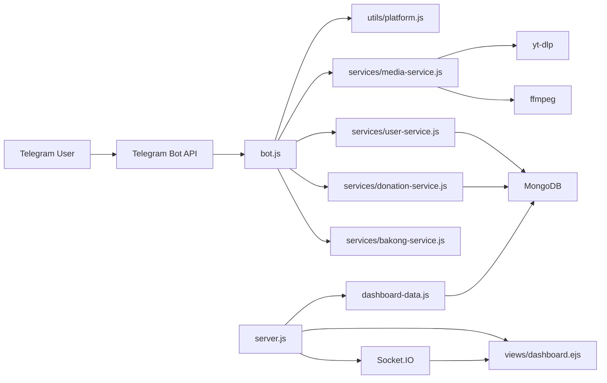

# Nexus Multi-Platform Media Bot

<div align="center">

Modern Telegram media bot with a polished chat UX, bilingual flows, KHQR donations, and a responsive analytics dashboard for operators.

<p>
  
  
  
  
  
  
</p>

</div>

---

## Table of Contents

- [Overview](#overview)
- [What The Bot Does](#what-the-bot-does)
- [Dashboard Modules](#dashboard-modules)
- [Feature Highlights](#feature-highlights)
- [Architecture](#architecture)
- [Project Structure](#project-structure)
- [Getting Started](#getting-started)
- [Media Runtime](#media-runtime)
- [Environment Variables](#environment-variables)
- [Donation Flow](#donation-flow)
- [Bot Commands](#bot-commands)
- [Deployment Notes](#deployment-notes)
- [Implementation Notes](#implementation-notes)
- [License](#license)

## Overview

This project is no longer just a TikTok downloader. It is now a broader Telegram media workflow built around four core ideas:

- `🤖` A Telegram bot that auto-detects supported links from normal chat messages.
- `🎬` Video delivery for TikTok, Facebook, and Instagram reels or short links.
- `🎵` YouTube to MP3 conversion with `yt-dlp` and `ffmpeg`.
- `📊` A responsive admin dashboard with overview, users, donations, blocking controls, search, sorting, and filters.

The bot is designed for real operator usage instead of demo-only behavior. It stores user activity, download history, donation history, language preference, moderation state, and platform usage in MongoDB.

## What The Bot Does

### User experience

- `✨` `/start` opens a richer welcome screen with icon-first actions and feature overview.
- `🌐` Users can switch between English and Khmer.
- `🔗` The bot extracts the first supported URL from a message automatically.
- `📦` TikTok, Facebook, and Instagram are returned as video.
- `🎧` YouTube links are converted and returned as MP3.
- `🧾` Returned media includes the original source link in the caption.
- `❤️` Donations can be created through KHQR, checked automatically, and tracked in the dashboard.

### Supported links

| Platform | Input examples | Output |
| --- | --- | --- |
| TikTok | `tiktok.com/...`, `vm.tiktok.com/...` | Video |
| Facebook | `facebook.com/...`, `fb.watch/...` | Video |
| Instagram | `instagram.com/reel/...`, `instagram.com/p/...` | Video |
| YouTube | `youtube.com/watch?...`, `youtube.com/shorts/...`, `youtu.be/...` | MP3 |

## Dashboard Modules

The dashboard is built as a small admin app with a left sidebar and three main sections:

### `📈 Dashboard`

- total users, downloads, failures, active users, donation totals
- 7-day charts for signups, downloads, failures, and donations
- platform, media type, language, donation status, and currency breakdowns
- recent activity panels for downloads and donations

### `👤 Users`

- full user list with download and donation metrics
- block and unblock actions
- search by name, username, or Telegram ID
- sort and filter by status, language, and day window
- responsive table on desktop and cards on mobile

### `💸 Donations`

- persistent donation history in MongoDB
- success, pending, expired, failed, and auth-error states
- search, sort, and filter by currency, status, and date
- quick operator visibility into KHQR activity

## Feature Highlights

| Area | Details |
| --- | --- |
| Bot UX | Icon-first menus, styled HTML text, bilingual replies, guided `/start` flow |
| Media engine | Smart URL detection, platform routing, temp-file cleanup, size guardrails |
| Donation system | KHQR card generation, 3-minute expiry, 3-second auto-check, thank-you confirmation |
| Moderation | User block/unblock from dashboard and bot-side enforcement |
| Analytics | User records, download events, donation events, active-user memory cache |
| Dashboard UI | Left sidebar, responsive layout, live sync through Socket.IO, simple clean styling |

## Architecture



## Project Structure

```text
botdownloadtiktok/
|-- bot.js
|-- server.js
|-- downloader.js
|-- dashboard-data.js
|-- dashboard.css
|-- dashboard.js
|-- views/
|   \-- dashboard.ejs
|-- models/
|   |-- User.js
|   |-- DownloadEvent.js
|   \-- DonationEvent.js
|-- services/
|   |-- media-service.js
|   |-- runtime-tools.js
|   |-- user-service.js
|   |-- donation-service.js
|   \-- bakong-service.js
|-- utils/
|   \-- platform.js
|-- locales/
|   \-- messages.js
|-- scripts/
|   |-- check-media-tools.js
|   |-- setup-media-tools.ps1
|   \-- setup-media-tools.sh
|-- bin/
|   |-- yt-dlp.exe
|   \-- ffmpeg.exe
|-- package.json
|-- package-lock.json
|-- .env
\-- README.md
```

## Getting Started

### 1. Prerequisites

- Node.js LTS
- npm
- MongoDB or MongoDB Atlas
- Telegram bot token from BotFather
- `yt-dlp`
- `ffmpeg`

### 2. Install dependencies

```bash
npm install
```

### 3. Check the media runtime

```bash
npm run check:media-tools
```

If the tools are missing, run one of these:

```bash
npm run setup:media:windows
```

```bash
npm run setup:media:linux
```

### 4. Create `.env`

Copy `.env.example` to `.env`, then fill in your real values.

```env
TELEGRAM_TOKEN=your_telegram_bot_token
MONGO_URI=your_mongodb_connection_string
PORT=3000
RENDER_EXTERNAL_URL=

BAKONG_ACCOUNT_ID=your_bakong_account
MERCHANT_NAME=Your Merchant Name
BAKONG_API_TOKEN=your_bakong_api_token
BAKONG_API_EMAIL=your_bakong_registered_email
BAKONG_API_BASE_URL=https://api-bakong.nbc.gov.kh

PAYWAY_LINK=https://link.payway.com.kh/your-link
GITHUB_LINK=https://github.com/your-repo
SUPPORT_LINK=https://t.me/your-support-account

YTDLP_BIN=
FFMPEG_BIN=
```

### 5. Start locally

```bash
npm run dev
```

### 6. Open the dashboard

```text
http://localhost:3000
```

## Media Runtime

The media pipeline depends on external binaries:

| Tool | Purpose | Required for |
| --- | --- | --- |
| `yt-dlp` | Download and extract platform media | All supported platforms |
| `ffmpeg` | Convert source media into MP3 | YouTube audio flow |

Runtime resolution order:

1. `YTDLP_BIN` / `FFMPEG_BIN`
2. local `./bin`
3. local `./vendor`
4. system `PATH`

Useful commands:

```bash
npm run check:media-tools
```

```bash
npm run setup:media:windows
```

```bash
npm run setup:media:linux
```

## Environment Variables

| Variable | Required | Purpose |
| --- | --- | --- |
| `TELEGRAM_TOKEN` | Yes | Telegram bot token |
| `MONGO_URI` | Yes | MongoDB connection string |
| `PORT` | No | HTTP server port, default `3000` |
| `RENDER_EXTERNAL_URL` | No | Public URL for webhook deployments |
| `BAKONG_ACCOUNT_ID` | Optional | Merchant Bakong account used to generate KHQR |
| `MERCHANT_NAME` | Optional | Merchant name printed on the KHQR card |
| `BAKONG_API_TOKEN` | Optional | Used for `check_transaction_by_md5` verification |
| `BAKONG_API_EMAIL` | Optional | Used to renew Bakong API token automatically |
| `BAKONG_API_BASE_URL` | No | Overrides Bakong API base URL |
| `PAYWAY_LINK` | Optional | Backup payment link shown in donation caption |
| `GITHUB_LINK` | Optional | Used in `/source` and menu source button |
| `SUPPORT_LINK` | Optional | Used in `/contact` and menu support button |
| `YTDLP_BIN` | Optional | Absolute path to a custom `yt-dlp` binary |
| `FFMPEG_BIN` | Optional | Absolute path to a custom `ffmpeg` binary |

## Donation Flow

The donation UX is designed as a guided Telegram flow:

1. User opens `Donate`
2. User selects currency
3. User selects amount
4. Bot generates a branded KHQR card
5. Bot checks payment every `3 seconds`
6. QR expires after `3 minutes`
7. On success, the bot deletes the QR card and sends an automatic thank-you message

Donation records are stored in MongoDB with status, amount, bill number, md5, timestamps, and verification results.

## Bot Commands

| Command | Purpose |
| --- | --- |
| `/start` | Show welcome screen and feature summary |
| `/help` | Show supported platforms and quick guidance |
| `/language` | Switch between English and Khmer |
| `/donate` | Open currency and amount selection for KHQR donations |
| `/source` | Open repository link |
| `/contact` | Open support link |

## Deployment Notes

### Local mode

If `RENDER_EXTERNAL_URL` is empty or points to localhost, the bot runs in Telegram polling mode.

### Public deployment mode

If `RENDER_EXTERNAL_URL` is a public URL, the bot registers a Telegram webhook at:

```text
/bot<TELEGRAM_TOKEN>
```

### Recommended production stack

- AWS EC2 or similar VM
- MongoDB Atlas
- PM2
- Nginx

## Implementation Notes

- The dashboard now uses custom EJS, CSS, Chart.js, and Socket.IO. It is not using the older Tailwind-only approach.
- User state, download history, and donation history are all persisted in MongoDB.
- Donation history only exists from the version that introduced `DonationEvent` onward unless older data is backfilled.
- Media preparation writes to a temp directory, then cleans it up after Telegram upload or failure.
- YouTube is intentionally treated as `audio`; the current flow converts it to MP3 instead of returning video.
- Telegram upload limits still apply, so very large source files can fail even when the original media is valid.

## License

This project is licensed under the `ISC` license.
