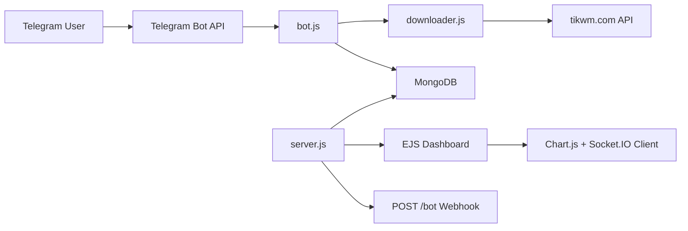

# Nexus TikTok Downloader Bot

<div align="center">

Professional Telegram bot for downloading TikTok videos without watermarks, backed by MongoDB analytics and an EJS admin dashboard.

<p>
  
  
  
  
  
</p>

</div>

---

## Table of Contents

- [Overview](#overview)
- [Project Analysis](#project-analysis)
- [Feature Highlights](#feature-highlights)
- [Architecture](#architecture)
- [Tech Stack](#tech-stack)
- [Project Structure](#project-structure)
- [Getting Started](#getting-started)
- [Environment Variables](#environment-variables)
- [Run Modes](#run-modes)
- [Customization Notes](#customization-notes)
- [Implementation Notes](#implementation-notes)
- [License](#license)

## Overview

**What this project does**

- Downloads TikTok videos through a Telegram bot workflow.
- Uses a retry-based extractor that prefers HD playback when available.
- Persists user activity and download counts in MongoDB.
- Serves a styled admin dashboard with usage totals, recent users, and a 7-day growth chart.
- Includes a donation flow powered by Bakong KHQR and a PayWay link.

**Who this is for**

- Developers building a Telegram utility bot.
- Operators who want a simple analytics dashboard next to the bot runtime.
- Teams looking for a deployable Node.js starter that supports both local polling and production webhooks.

## Project Analysis

This repository is organized around three core runtime pieces:

| Area | Responsibility | Main File |
| --- | --- | --- |
| Bot runtime | Handles Telegram commands, TikTok links, donations, and user updates | `bot.js` |
| Download service | Calls the external TikTok API, retries failures, and selects the media URL | `downloader.js` |
| Web server | Hosts the dashboard, receives Telegram webhooks, and connects MongoDB | `server.js` |

**Code-level observations**

- The bot switches automatically between `polling` for local development and `webhook` mode for public deployments.
- User data is stored in MongoDB through a single `User` model with `downloads`, `joinedAt`, and `lastActive` fields.
- The dashboard UI is visually polished and uses Tailwind CSS, Chart.js, Socket.IO, and EJS server rendering.
- Donation support is already integrated and generates branded KHQR cards on demand.
- The current dashboard includes Socket.IO client wiring, but the backend does not yet broadcast live stat updates.

## Feature Highlights

| Icon | Capability | Current Behavior |
| --- | --- | --- |
| :clapper: | TikTok download flow | Accepts TikTok URLs from Telegram chat and returns the downloadable video |
| :brain: | Smart media selection | Prefers HD output, then falls back to normal quality if the file is too large |
| :repeat: | Retry strategy | Retries extractor requests up to 100 times with rotating user agents |
| :bar_chart: | Analytics dashboard | Displays total downloads, user totals, recent users, and a weekly chart |
| :floppy_disk: | MongoDB tracking | Stores unique Telegram users and increments per-user download counts |
| :moneybag: | Donation support | Generates Bakong KHQR payment cards and shares a PayWay link |
| :globe_with_meridians: | Dual runtime mode | Uses polling locally and webhooks in a deployed environment |

## Architecture



**Runtime flow**

1. A user sends a TikTok URL to the Telegram bot.
2. `bot.js` calls `getTikTokData()` from `downloader.js`.
3. The extractor requests metadata from `tikwm.com`, selects the best playable media URL, and returns it.
4. The bot sends the video back to Telegram and updates the MongoDB user record.
5. `server.js` renders dashboard metrics from MongoDB and exposes the webhook endpoint for production use.

## Tech Stack

| Layer | Tools |
| --- | --- |
| Backend | Node.js, Express 5, body-parser, compression |
| Bot | node-telegram-bot-api |
| Database | MongoDB, Mongoose |
| Dashboard | EJS, Tailwind CSS CDN, Chart.js, Socket.IO |
| Media / Payments | Axios, canvas, qrcode, bakong-khqr |
| Dev tooling | Nodemon, dotenv |

## Project Structure

```text
botdownloadtiktok/
|-- bot.js
|-- downloader.js
|-- server.js
|-- models/
|   \-- User.js
|-- views/
|   \-- dashboard.ejs
|-- .gitignore
|-- package.json
|-- package-lock.json
\-- README.md
```

## Getting Started

### 1. Prerequisites

- Node.js LTS
- npm
- MongoDB database
- Telegram bot token from BotFather

### 2. Install dependencies

```bash
npm install
```

### 3. Create a `.env` file

```env
TELEGRAM_TOKEN=your_telegram_bot_token
MONGO_URI=your_mongodb_connection_string
PORT=3000
RENDER_EXTERNAL_URL=
BAKONG_ACCOUNT_ID=your_bakong_account_id
MERCHANT_NAME=Your Merchant Name
```

### 4. Start the app

```bash
npm run dev
```

### 5. Open the dashboard

```text
http://localhost:3000
```

### 6. Use the bot

- Send `/start` to initialize the conversation.
- Send a TikTok link to trigger a download.
- Use `/help`, `/source`, or `/contact` for the built-in utility commands.

## Environment Variables

| Variable | Required | Purpose |
| --- | --- | --- |
| `TELEGRAM_TOKEN` | Yes | Telegram bot token used by the bot runtime and webhook route |
| `MONGO_URI` | Yes | MongoDB connection string for analytics and user tracking |
| `PORT` | No | HTTP port for the Express server, default is `3000` |
| `RENDER_EXTERNAL_URL` | No | Public base URL for deployed webhook mode |
| `BAKONG_ACCOUNT_ID` | Optional | Required if the Bakong donation flow should work |
| `MERCHANT_NAME` | Optional | Display name used on generated KHQR cards |

## Run Modes

| Mode | Trigger | Behavior |
| --- | --- | --- |
| Local development | `RENDER_EXTERNAL_URL` is empty or resolves to `localhost` | Bot starts in Telegram polling mode |
| Cloud deployment | `RENDER_EXTERNAL_URL` is set to a public URL | Bot registers a Telegram webhook at `/bot<TOKEN>` |

## Customization Notes

Project-specific branding and links are currently defined directly in `bot.js`.

- `GITHUB_LINK` controls the `/source` command target.
- `PAYWAY_LINK` controls the payment shortcut shared in donation responses.
- Support contact links and email text are also hardcoded in the command handlers.
- Dashboard branding such as "NexusBot" and "Mission Control" lives in `views/dashboard.ejs`.

## Implementation Notes

These details are worth knowing before production rollout:

- Socket.IO is initialized and the dashboard client listens for `update_stats`, but the current backend does not emit that event yet.
- `state.userList` exists for active session tracking, but it is not populated in the current bot flow, so live presence widgets stay empty.
- The bot depends on the third-party `tikwm.com` API for TikTok extraction, so availability and response quality depend on that upstream service.
- This repository currently does not include an automated test suite.

## License

This project is currently licensed as `ISC` in `package.json`.
